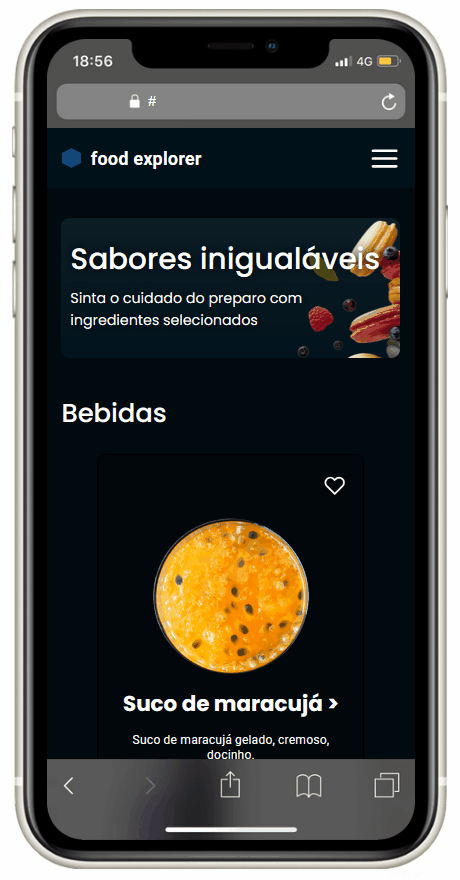

# :hamburger: food explorer - Frontend

food explorer é uma aplicação que simula o site de restaurante, ou seja um cliente pode fazer pedidos, e administrador gerencia esses pedidos.

<h1 align="center">
    
</h1>

## :open_book: Sumário

- [Pré-Visualização](#clapper-pré-visualização)
- [Aviso](#loudspeaker-aviso)
- [Sobre](#memo-sobre)
- [Tecnologias](#floppy_disk-tecnologias)
- [Funcionalidades](#hammer-funcionalidades)
- [Autor](#nerd_face-autor)

 

## :clapper: Pré-Visualização

<h1 align="center">
  
</h1>

<h1 align="center">
  
</h1>

 

## :loudspeaker: Aviso

- O projeto **está finalizado**, mas poderá ter melhorias no futuro.

- Você também pode clonar o repositório, e executar a aplicação localmente.

 

## :memo: Sobre

Este é o projeto final do programa [Explorer da Rocketseat](https://www.rocketseat.com.br/explorer), aonde foi proposto a construção de uma aplicação para gerenciar os pedidos de um restaurante.
Basicamente a aplicação tem 3 personas:

- Visitante: tem acesso a home, pode fazer a busca prato pelo nome, visualizar os pratos de forma detalhada e também pode adicionar produtos ao carrinho.
- Cliente: tem as mesmas funcionalidades de um visitante, com o acréscimo de poder adicionar produtos aos favoritos, finalizar uma compra, ver todos os seus pedidos feitos, ver a situação de um pedido especifico e atualizar as informações de seu perfil (nome, e-mail, senha).

- Administrador: tem os mesmos acessos de um cliente com a exceção de favoritar pratos, e fazer pedidos, e com a acréscimo de cadastrar pratos, editar pratos, editar a situação de um pedido, e visualizar todos os pedidos feitos no site.

 

## :floppy_disk: Tecnologias

- **ReactJS** - utilizado para construir as interfaces;
- **JS** - usado para fazer toda a lógica da aplicação;
- **Styled Components** - utilizado para fazer a estilização;
- **Git** - responsável por realizar o versionamento do código.
- **Axios** - utilizado para fazer as requisições.
- **Vite** - usado para criar um projeto React;
- **NPM** - utilizado para realizar a instalação das dependências;

 

## :hammer: Funcionalidades

- [x] Mostrar todos pratos;
- [x] Mostrar um prato especifico;
- [x] Fazer a busca de um prato pelo nome;
- [x] Adicionar ao carrinho;
- [x] Visualizar o carrinho;
- [x] Criar conta;
- [x] Fazer login;
- [x] Atualizar informações da conta;
- [x] Adicionar um prato aos favoritos;
- [x] Fazer um pedido;
- [x] Ver a todos os seus pedidos;
- [x] Ver os detalhes de um pedido especifico;
- [x] Cadastrar um prato;
- [x] Editar um prato;
- [x] Editar a situação de um pedido;
- [x] Visualizar todos os pedidos feitos por todos os clientes;

 

## :bulb: Utilização

- Para utilizar esse projeto localmente, primeiro você precisará instalar o backend conforme [essa documentação](https://github.com/devoctaviooliveira/desafio-final).

